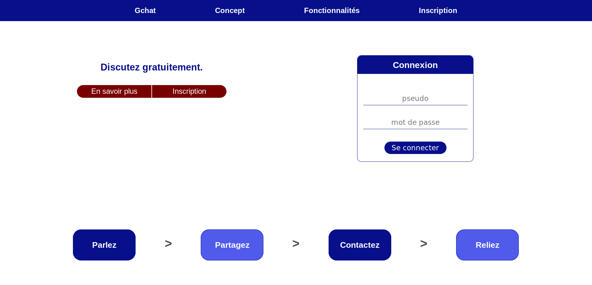
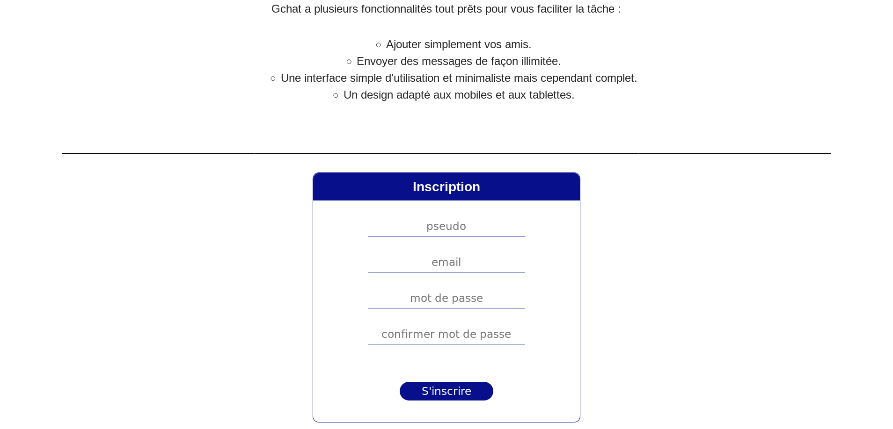
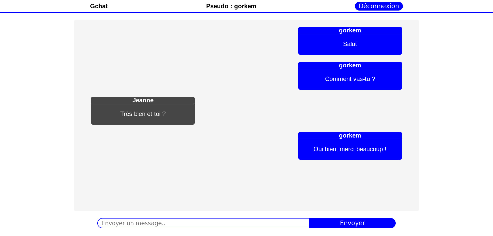
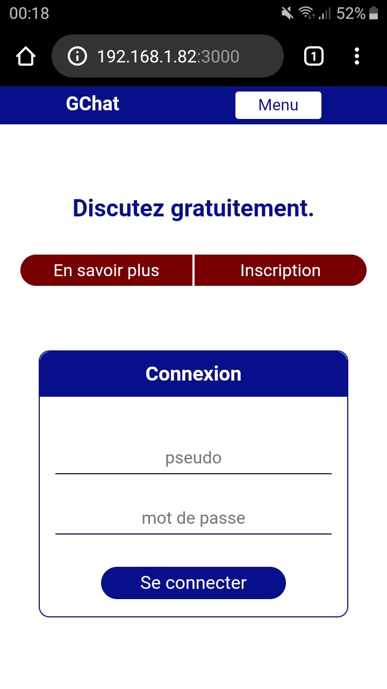
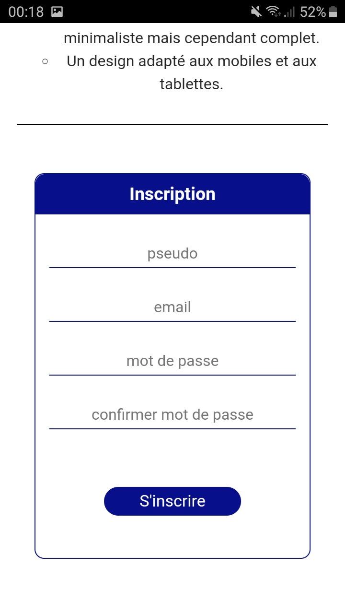
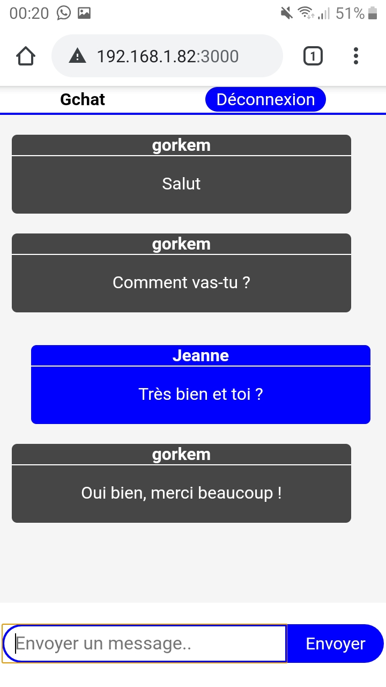

# gchat
Une messagerie instantanée générale avec inscription / connexion codée en HTML, CSS, ReactJS, et utilisant NodeJS, ExpressJS et MySQL comme côté serveur.

___________________________________________________ 

___________________________________________________ 

___________________________________________________ 

___________________________________________________ 

___________________________________________________ 

